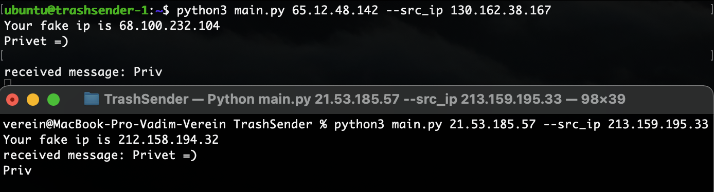

# TrashSender

Утилита позволяет обмениваться сообщениями по UDP, стараясь маскироваться под мусорный трафик.
Собеседник не будет знать ваш реальный ip.

### Как пользоваться
Чтобы получить фейковый ip запустите программу с указанием вашего интерфейса через ключ --src_ip  
Для корректной работы у вас и вашего собеседника должен быть одинаковый параметр -c  
Программа посылает сообщения на последний ip адрес, с которого пришло сообщение

### Запуск
```sh
$ python3 main.py [host] [-c count, 256 default] [--src_ip Interface]
```

### [OPTIONS]
```sh
host IP
--src_ip Возможность указать интерфейс, отличный от найденного по умолчанию
-c Количество IP адресов на которые будут отправляться сообщения. По умолчанию 256, возможные варианты: [18, 52, 86, 256, 772, 1286]
!ВАЖНО! Параметр -c должен быть одинаковый у вас и вашего собеседника
```

